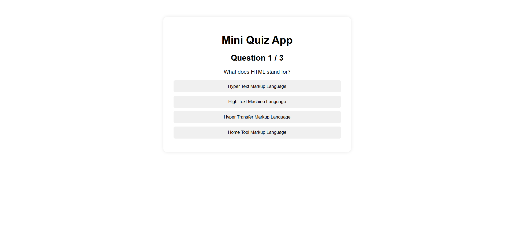
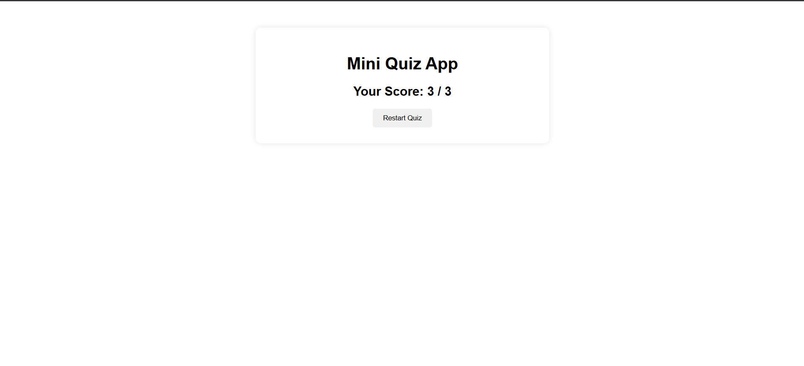

# Mini Quiz App

A simple quiz application built using Qwik.

This project was created to understand the basics of Qwik such as components, signals, event handling, conditional rendering, and scoped styling by building a small interactive application.

---

## Features

- Multiple choice quiz interface
- Score calculation
- Restart quiz functionality
- Responsive and simple user interface
- Scoped component styling

---

## Screenshots

### Quiz Interface



### Result Screen



---

## Technologies Used

- Qwik
- TypeScript
- CSS

---

## Project Structure

```bash
src
│
├── routes
│   ├── index.tsx
│   └── style.css
│
├── root.tsx
├── global.css
├── entry.dev.tsx
├── entry.preview.tsx
└── entry.ssr.tsx
